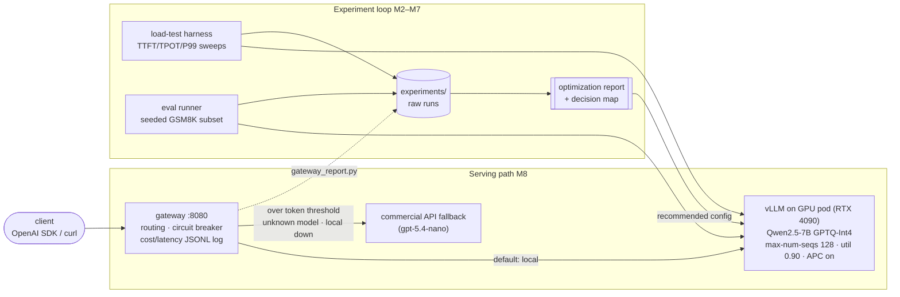

# inference_lab

> **📊 Key deliverable: [the optimization report](report/optimization_report.md)** —
> what quantization, prefix caching, and batching/KV tuning each buy in speed, dollars,
> and quality on a self-hosted Qwen2.5-7B, with a workload→configuration decision map.
> One-page version: [report/SUMMARY.md](report/SUMMARY.md).
>
> **Headline results:** 4-bit GPTQ = **2.6× faster decode** at −2.3 GSM8K pts ·
> cheapest measured tokens **$0.045–0.062 per 1M output** · prefix caching =
> **−82% TTFT p99** and 2.6× throughput on RAG-shape traffic · self-hosting beats a
> same-model hosted API above **~29% sustained utilization**.

Self-hosted LLM inference benchmarking and optimization lab. For a chosen open-source model (Qwen/Llama, 7B–8B) served with vLLM on rented cloud GPUs, this project measures — with a self-built load-testing harness — how each serving optimization (**AWQ/GPTQ/FP8 quantization, prefix caching, continuous-batching parameters, KV-cache memory allocation, speculative decoding**) trades speed and $/1M-token cost against answer quality, and turns the results into a data-backed decision map a team running these models could actually use. A thin OpenAI-compatible gateway (routing + per-request cost/latency logging) fronts the tuned deployment.

## Architecture



The experiment loop produced the report; the report's recommended configuration is what
the serving path deploys.

## Repo layout

```
inference_lab/     Python package — all source code
  loadtest/        async load-test harness: workloads, sweeps, TTFT/TPOT/P99 stats (M2)
  evals/           quality eval runner: seeded GSM8K/MMLU subsets (M3)
  gateway/         OpenAI-compatible routing gateway with cost logging (M8)
  common/          shared config models + structured JSONL logging
docs/              performance ledger, per-experiment writeups
experiments/       one dir per run: configs, environment versions, raw results
report/            the final optimization report (key deliverable)
scripts/           GPU-pod setup/run scripts
tests/             pytest suite (everything testable locally against a mock server)
```

## Setup

```bash
python3 -m venv .venv && source .venv/bin/activate
pip install -e '.[dev]'
pytest && ruff check .
```

## Load-test harness (M2)

An async closed-loop load tester for any OpenAI-compatible streaming endpoint,
measuring TTFT, TPOT, throughput, and P50/P90/P99 latency across concurrency levels.

```bash
# Workload spec (saved into every run dir for reproducibility):
cat > chat_workload.json <<'EOF'
{"mode": "synthetic", "input_tokens": 512, "output_tokens": 256,
 "shared_prefix_tokens": 200, "num_prompts": 128, "seed": 0}
EOF
# ({"mode": "sharegpt", "num_prompts": 128, "seed": 0} samples real conversations instead)

python -m inference_lab.loadtest \
  --endpoint http://localhost:8000/v1 --model Qwen/Qwen2.5-7B-Instruct \
  --workload chat_workload.json --concurrency 1,4,8,16,32,64 \
  --out experiments/baseline

python -m inference_lab.loadtest plot experiments/baseline   # re-render PNGs

python -m inference_lab.loadtest plot-overlay \
  fp16=experiments/baseline-fp16 awq=experiments/quant-awq \
  --out-dir experiments/quant-overlay   # A/B runs on shared axes (≤4)
```

Each run directory contains `workload.json`, `meta.json` (endpoint, versions,
timestamps), `requests.jsonl` (raw per-request records — every aggregate is
recomputable), `summary.json` (per-concurrency aggregates), and three plots.
For offline development there is a mock OpenAI-compatible server with
configurable artificial delays: `python -m inference_lab.loadtest.mockserver
--ttft 0.08 --tpot 0.005` (see `experiments/demo-mock-server/` for a sample
run against it). Closed-loop only; open-loop (Poisson-arrival) generation is
future work.

## Quality evals (M3)

The quality gate for every optimization experiment: a fixed, seeded GSM8K
subset (same questions in every run, forever — the subset ids and a content
hash are recorded in `meta.json`) scored by exact match on the parsed final
numeric answer, at temperature 0 against any OpenAI-compatible endpoint.

```bash
python -m inference_lab.evals \
  --endpoint http://localhost:8000/v1 --model Qwen/Qwen2.5-7B-Instruct \
  --task gsm8k --num-questions 300 --out experiments/baseline

# Score delta + the exact questions that flipped correct<->wrong:
python -m inference_lab.evals compare experiments/baseline experiments/quant-awq
```

Each run writes `experiments/<name>/eval/` with `meta.json`, `questions.jsonl`
(raw per-question records — the score is recomputable), and `score.json`.
Failed requests count as wrong (denominators stay comparable) and are reported
as `num_errors`. The task abstraction takes one class per additional task
(MMLU is future work). See `experiments/demo-eval-mock-{a,b}/` for sample runs
against the mock server.

## Gateway (M8)

A thin OpenAI-compatible gateway fronting the tuned vLLM deployment, with a
commercial-API fallback. Config-driven (endpoints, models, prices, thresholds —
nothing hardcoded; see [`configs/gateway.example.json`](configs/gateway.example.json)),
streaming and non-streaming, `/health`, and one JSONL log event per request.

```bash
export OPENAI_API_KEY=...   # fallback key: named in config by env var, never stored
python -m inference_lab.gateway --config configs/gateway.example.json --port 8080

python scripts/gateway_report.py gateway_log.jsonl   # cost/latency/routing summary
```

Routing is deliberately simple and explainable — fallback when the estimated prompt
tokens exceed a threshold (the KV-wall guard), the requested model isn't served
locally, or the local backend is unhealthy (health probe + a circuit breaker on
consecutive failures). Every response names its backend and route reason in
`x-gateway-*` headers; every log line carries exact token counts, TTFT, latency, and
a cost **with the assumption it rests on** (local $/token is utilization- and
regime-dependent — report §7). Known limitation, documented in
`inference_lab/gateway/routing.py`: the threshold counts raw prompt tokens, but what
is actually expensive locally is *unique* (non-cached) tokens — shared-prefix long
prompts measured as the cheapest traffic to serve (M6).

## Milestones

- [x] **M0** — Repo scaffold & tooling
- [x] **M1** — Performance ledger (theoretical TTFT/throughput limits)
- [x] **M2** — Load-test harness
- [x] **M3** — Quality eval runner
- [x] **M4** — Baseline deployment & measurement (GPU) — [results](docs/baseline_results.md): 4090 FP16 baseline 63 tok/s @ c=1 (88% of theoretical ceiling), 2.8k tok/s steady-state @ c=64, GSM8K 92.7%, harness cross-validated vs `vllm bench` (TPOT within 2%)
- [x] **M5** — Experiment: quantization (GPU) — [results](docs/experiment_quantization.md): GPTQ/AWQ 4-bit = 2.6× batch-1 decode, 1.5× steady-state @ c=64, 2.45× KV headroom, GSM8K −2.3 to −2.7 pts (flips are interpretation errors, churn FP8 11 < GPTQ 15 < AWQ 20); FP8 true W8A8 on Ada verified; $/1M out: $0.045 (GPTQ) vs $0.069 (FP16)
- [x] **M6** — Experiments: prefix caching & batching/KV params (GPU) — [results](docs/experiment_caching_batching.md): prefix caching cuts RAG-shape TTFT p99 −82% and lifts throughput 2.6× at c=64 (hit rate = prefix share); KV preemption wall lands exactly at pool ÷ tokens-per-seq (0 preempts at 0.88×wall, 37 at 1.10×) and APC defers it ~3.9×; max-num-seqs is an admission valve (where load waits), throughput saturates by 128; util 0.95 OOMs on 24 GB
- [x] **M7** — Optimization report & cost analysis — [report](report/optimization_report.md) · [1-page summary](report/SUMMARY.md): every experiment synthesized into a decision map; $/1M-token per config ($0.045–0.232 measured); break-even vs commercial APIs (self-hosting wins above ~29% sustained utilization vs a same-model hosted API, prices dated 2026-07-19); all figures regenerated reproducibly by `scripts/make_report_plots.py`
- [x] **M8** — Gateway & end-to-end demo — [demo](docs/demo_e2e.md): OpenAI-compatible gateway routing between the vLLM pod (report's recommended config) and a commercial fallback, demonstrated live: all six routing reasons in one log, 92% prefix-cache hit rate on shared-prefix traffic, zero client-visible failures during a forced local outage, every logged cost paired with its utilization/regime assumption
