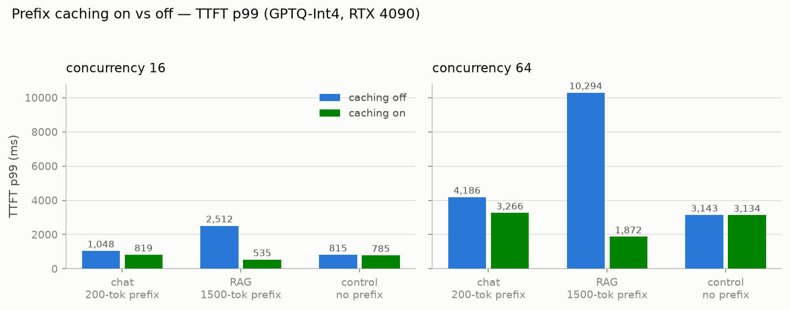
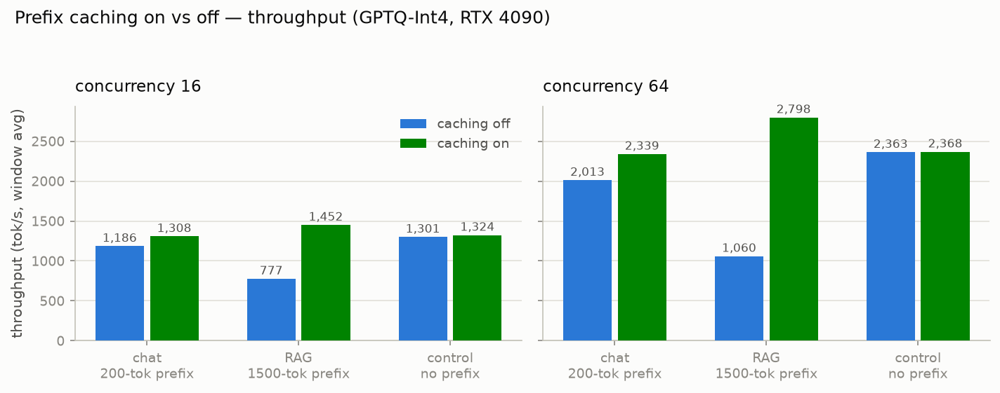
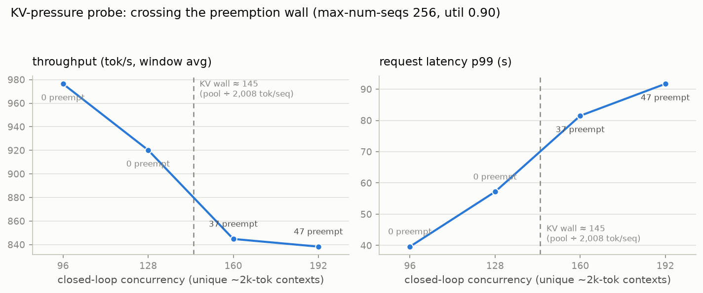
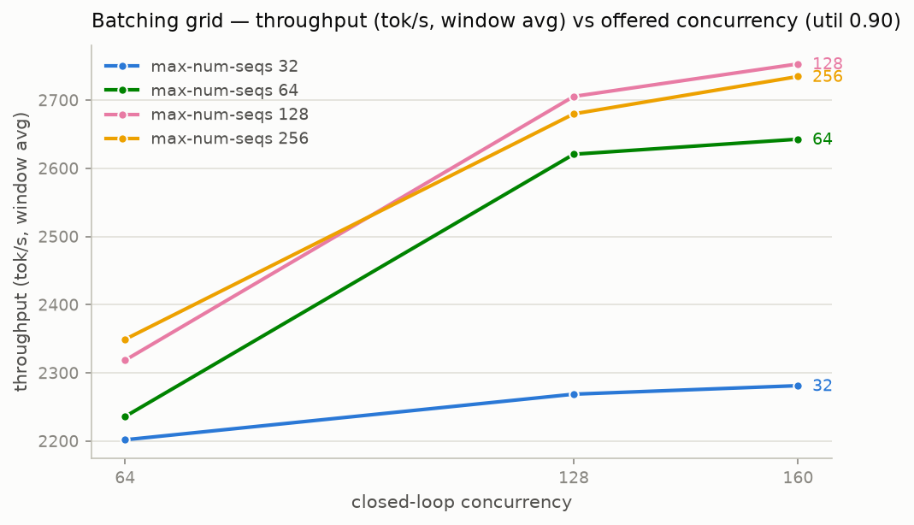
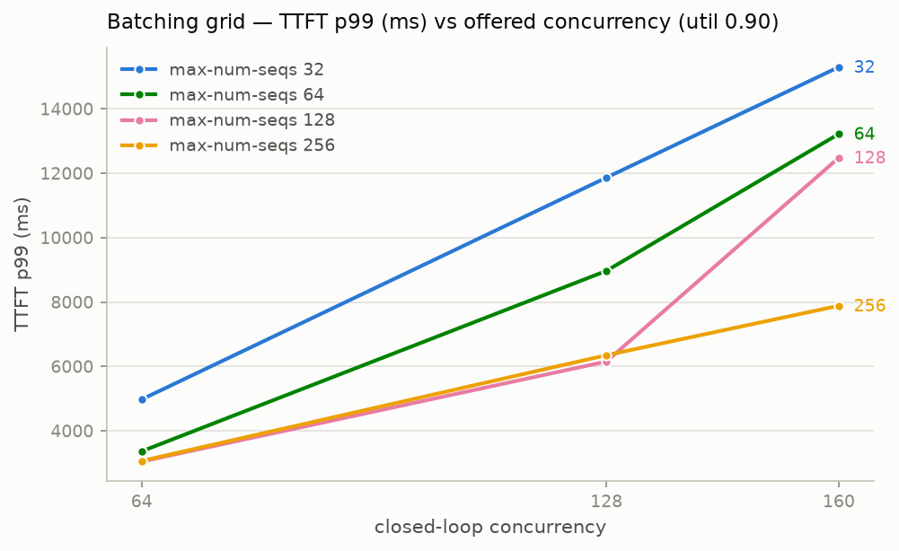
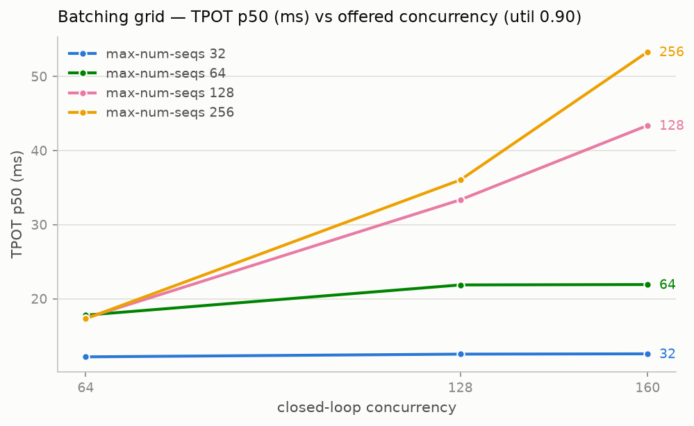

# Experiment: Prefix Caching & Batching/KV Parameters (M6)

> The scheduling/memory experiments: what does vLLM's automatic prefix caching (APC) buy on
> each workload shape, and how do `--max-num-seqs` / `--gpu-memory-utilization` move the
> throughput/latency trade-off — including the preemption regime when the KV pool runs out.
> Base config (settled by M5): **GPTQ-Int4** (`Qwen/Qwen2.5-7B-Instruct-GPTQ-Int4`). Raw data:
> [`experiments/prefix-cache-*/`](../experiments/), [`…/batching-grid/`](../experiments/batching-grid/),
> [`…/kv-pressure/`](../experiments/kv-pressure/).

## Setup

| | |
|---|---|
| GPU / stack | RTX 4090 24 GB (RunPod secure, $0.69/hr), driver 570.195.03, vLLM 0.25.1+cu129, torch 2.11.0+cu129 — same class/stack as M4/M5 |
| Serve command | `vllm serve Qwen/Qwen2.5-7B-Instruct-GPTQ-Int4` + only the flags each arm varies |
| Protocol | closed loop, `num_requests = 4 × concurrency` per cell (M4 rule), 8 warmup; **fresh seed and fresh prompt pool per cell** (`num_prompts = warmup + num_requests`, no round-robin replay); server restarted between caching arms |
| Metrics evidence | per-cell `/metrics` snapshots (before/after): `vllm:num_preemptions_total`, `vllm:prefix_cache_{queries,hits}_total`; per-config serve-log extracts (KV-pool size, kernel, flags) |

Protocol notes, learned the hard way in M4/M5 and applied here:

- **Fresh seeds everywhere.** Replaying an already-seen seeded workload measures the cache,
  not the server. Unlike the M4/M5 sweeps (which reused 128 prompts across levels → ~90%
  cache hit rate), every M6 cell generates never-seen prompts. This matters more than it
  sounds — see [the accounting note](#accounting-note) below.
- The on/off arms of Experiment A use the **same seed per cell** (identical workloads —
  the A/B is byte-exact); this is safe because each server lifetime sees a seed exactly once.
- The off-arm flag `--no-enable-prefix-caching` was smoke-checked at serve time: the serve
  log records `enable_prefix_caching=False` (and `=True` for the on arm) — extracts committed
  per run.

## Experiment A — prefix caching, on vs off

Three shapes at c=16 and c=64, 256 output tokens, `ignore_eos`:

| shape | shared system prefix | unique user tokens | prefill/request | prefix share |
|---|---|---|---|---|
| chat | 200 | 512 | ~724 | ~28% |
| RAG/agent | 1500 | 240 | ~1752 | ~86% |
| control | none | 512 | ~524 | 0% |

Measured cache hit rates match the prefix share almost exactly — chat 28.3–28.6%, RAG
84.7–85.5%, control 2.9–3.8% (incidental 16-token block collisions in random filler): the
cache is doing precisely what it says, nothing more.

| shape, c | TTFT p50 off→on (ms) | TTFT p99 off→on (ms) | throughput off→on (tok/s) |
|---|---|---|---|
| chat, 16 | 671 → 592 (−12%) | 1,048 → 819 (−22%) | 1,186 → 1,308 (+10%) |
| chat, 64 | 1,730 → 1,780 (≈0)¹ | 4,186 → 3,266 (−22%) | 2,013 → 2,339 (+16%) |
| **RAG, 16** | **1,078 → 379 (−65%)** | **2,512 → 535 (−79%)** | **777 → 1,452 (1.87×)** |
| **RAG, 64** | 1,413 → 1,006 (−29%) | **10,294 → 1,872 (−82%)** | **1,060 → 2,799 (2.64×)** |
| control, 16 | 537 → 560 (+4%)¹ | 815 → 785 (−4%) | 1,301 → 1,325 (+2%) |
| control, 64 | 1,377 → 1,767¹ | 3,143 → 3,134 (0%) | 2,363 → 2,368 (0%) |

¹ Closed-loop TTFT p50 under saturation is wave-structured and noisy (requests arrive in
bursts as workers turn over); p99, throughput, and TPOT are the stable columns. The control's
throughput/TPOT/latency agree within ~1–2% across arms and its TTFT p99 is identical —
the **validity check passes**: no shared prefix, no effect.

**What happened, in the ledger's terms.** Prefill is compute-bound; APC removes the shared
prefix's share of prefill FLOPs entirely. On the chat shape that's 28% of prefill → modest
wins. On the RAG shape it's 86% of a much larger prefill → TTFT p99 collapses (−79/−82%) *and*
throughput jumps 1.9–2.6×, because under closed loop the GPU steps freed from prefill go
straight into decode. Two report-grade corollaries:

1. **With caching on, long-shared-prefix traffic becomes the *cheapest* to serve, not the
   most expensive**: RAG-on at c=64 (2,799 tok/s) out-throughputs even the no-prefix control
   (2,368) — its per-request *unique* work (240 tokens) is the smallest of the three shapes.
   Without caching the same traffic is the most expensive shape (1,060 tok/s). One flag, 2.6×.
2. **This is the TTFT lever quantization isn't.** M5 showed 4-bit weights *worsen* loaded
   TTFT (prefill is compute-bound; faster decode raises prefill arrival rate). As predicted
   there, the caching win is larger on the 4-bit base: it attacks exactly the phase
   quantization left as the bottleneck. The two optimizations compose: GPTQ takes decode,
   APC takes prefill.

## Experiment B2 — the KV wall (preemption regime)

**Design correction (measured, not just argued).** The original plan probed preemption with
the 1500-token *shared*-prefix shape. But with APC on (production default), concurrent
sequences **share** the prefix blocks — each sequence holds only ~500 unique KV tokens, so
the preemption wall sits at ~560 concurrent, unreachable below `max-num-seqs`. The wall
arithmetic (~2,008 tok/seq) only holds when every sequence carries its full context. So the
probe uses **unique ~2k-token contexts** (1,740 unique input + 256 out — the realistic RAG
regime where each request retrieves *different* documents), with the shared-prefix shape kept
as a contrast cell. `max-num-seqs=256` so admission cannot mask the wall.

Measured walls (serve-log `GPU KV cache size`, ÷ 2,008 tokens/seq):

| util | KV pool (tokens) | wall (concurrent seqs) |
|---|---|---|
| 0.90 | 291,168 | **≈ 145** |
| 0.80 | 247,120 | **≈ 123** |

| cell | c / wall | preemptions | TTFT p99 | latency p99 | TPOT p50 | tok/s |
|---|---|---|---|---|---|---|
| unique, c=96 | 0.66 | 0 | 16.2 s | 39.6 s | 94 ms | 976 |
| unique, c=128 | 0.88 | 0 | 23.4 s | 57.2 s | 136 ms | 920 |
| unique, c=160 | **1.10** | **37** | 31.5 s | **81.5 s** | 176 ms | 845 |
| unique, c=192 | **1.32** | **47** | 46.7 s | **91.7 s** | 177 ms | 838 |
| unique, c=128 @ util 0.80 | **1.04** | **8** | 23.3 s | 57.8 s | 138 ms | 908 |
| shared-prefix, c=160 | 0.29² | 0 | 4.8 s | 15.4 s | 40 ms | **3,195** |

² Effective: 160 × ~508 unique tokens/seq ÷ pool.

Findings, each with its mechanism:

- **The wall is exactly where the arithmetic says.** `vllm:num_preemptions_total` is zero at
  0.88× the wall and positive at 1.10× (37) and 1.32× (47), with the latency-p99 blowup and
  throughput *decline* (920 → 845 tok/s) the ledger predicted for preemption thrash
  (preempted sequences re-prefill their full ~1,750 tokens — pure wasted compute). This
  settles ledger **P12 ✅** (long-context preemption near predicted concurrency).
- **`gpu-memory-utilization` moves the wall, and only near the wall does it matter.** At
  c=128 the same workload preempts 8 times at util 0.80 (c/wall = 1.04) and zero times at
  0.90 (0.88) — one flag flips the regime. Far from the wall (512/256 shape, B1), util
  0.80 vs 0.90 changes throughput by 0.5% — the knob is insurance, not speed.
- **Unlike the 512/256 shape, long-context throughput falls with concurrency even *below*
  the wall** (976 → 920 tok/s): each decode step reads every live sequence's ~2k-token KV,
  so KV read traffic — not weight reads — becomes the bandwidth bill. Batching buys nothing
  once KV bytes dominate weight bytes.
- **APC defers the wall by the sharing factor.** The shared-prefix contrast cell at the same
  offered load (c=160, same token shape): zero preemptions, 3.8× the throughput, 5.3× lower
  p99. Prefix caching is not just a TTFT optimization — under memory pressure it is a
  *capacity* optimization (effective wall ~560 vs 145).
- **util 0.95 does not start on this card**: CUDA-graph capture OOMs after the engine plans a
  16.73 GiB KV pool (23.42 GiB in use vs 23.53 available) — evidence in
  [`mns256-util0.95-FAILED/`](../experiments/batching-grid/mns256-util0.95-FAILED/). On a
  24 GB card with this stack, **0.90 is already the practical ceiling**.

## Experiment B1 — `max-num-seqs` as an admission knob

512/256 chat shape (no preemption possible: wall ≈ 358 ≫ every cap), util 0.90,
c ∈ {64, 128, 160}:

| max-num-seqs | tok/s @ c=160 (window / steady¹) | TTFT p99 @ c=160 | TPOT p50 @ c=160 | latency p50/p99 @ c=160 |
|---|---|---|---|---|
| 32 | 2,281 / 2,351 | 15,298 ms | **12.6 ms** | 17.4 / 18.5 s |
| 64 | 2,643 / 3,019 | 13,221 ms | 21.9 ms | 13.6 / 18.9 s |
| **128** | **2,753 / 3,082** | 12,482 ms | 43.4 ms | 13.3 / 23.6 s |
| 256 | 2,735 / 2,799 | **7,884 ms** | 53.3 ms | **14.6 / 21.2 s** |

¹ steady-state = `c × 256 / median latency` (M4 convention).

- **Throughput saturates at `max-num-seqs` ≈ 128**: 32 caps the active batch hard
  (−17% throughput), 64 recovers most of it, 128 and 256 are statistically identical —
  once the batch is big enough to amortize weight reads (ledger: compute wall N* ≈ 60 on
  the 4-bit base), admitting more sequences adds no throughput on this shape.
- **The knob decides *where* excess load waits, not whether it waits.** Below the cap,
  extra requests queue outside the engine: TTFT explodes (mns=32: p99 15.3 s at c=160) while
  decode stays fast (TPOT 12.6 ms — the streaming experience of the lucky admitted). Above,
  everyone is admitted: TTFT halves (mns=256: 7.9 s) but every stream slows (TPOT 53 ms).
  Total p50 latency barely differs (13.3–17.4 s) — conservation of waiting.
- **Sweet spot for this shape: `max-num-seqs` 128–256 at util 0.90.** 128 edges 256 on
  steady-state throughput and p99-TTFT-vs-TPOT balance; 256 wins if TTFT is the SLO. mns=32
  is the choice only if per-stream TPOT is contractual and you can shed load upstream.
- `gpu-memory-utilization` ∈ {0.80, 0.90} at mns=256/c=160: 2,748 vs 2,735 tok/s — **no
  effect far from the KV wall**, as the mechanism requires (the pool is capacity, not speed).

## Accounting note: fresh vs cache-warm workloads (affects M5/M7)

B1's fresh-seed c=64 cell measured **2,559 tok/s steady-state** on the *same server config*
where M5's sweep (replaying 128 prompts across levels → ~90% full-prompt hit rate) measured
**4,234 tok/s** — a 1.65× gap, because fresh traffic pays ~724 prefill tokens per request
(2.8× the decode tokens) while replayed traffic prefills almost nothing. Neither number is
wrong: they measure different regimes (unique/cold traffic vs warm repeated-prompt traffic),
and every A/B ratio in M4/M5 holds because both sides used the same protocol. But **absolute
throughput and $/1M claims must state which regime they come from** — carried into M7 as a
hard rule alongside window-vs-steady-state.

## Cost ($0.69/hr, steady-state unless noted)

| config, workload | tok/s | $/1M output tok |
|---|---|---|
| GPTQ mns=128/util 0.90, 512/256 fresh, c=160 | 3,082 | **$0.062** |
| GPTQ default, RAG shape + APC (86% hit), c=64 | 3,086 | $0.062 |
| GPTQ default, RAG shape, caching off, c=64 | 1,108 | $0.173 |
| GPTQ, unique 2k-context below wall, c=128 | 902 | $0.213 |
| GPTQ, unique 2k-context past wall, c=160 | 825 | $0.232 |

The cheapest tokens on this card come from either the tuned 512/256 config **or**
prefix-heavy traffic with caching on — while unique long-context traffic costs 3.4× more per
token, and *crossing the wall makes it worse in both dollars and p99*. Capacity planning for
long-context services should be done in KV-tokens (pool ÷ tokens/seq), not requests/sec.

## Experiment C — speculative decoding: skipped (documented)

Skipped cleanly per plan: choosing and validating a speculative setup that vLLM 0.25's v1
engine actually supports for a GPTQ-quantized Qwen2.5-7B target (EAGLE-style head vs ngram
vs draft model — support differs by engine version and quantization) is a measurement
session of its own, with real risk of burning the budget on an immature path. A+B consumed
this session's measurement budget; the pod was released once their data was pulled. Revisit only if M7 identifies a
low-concurrency-latency gap worth its cost.

## Session cost

~1.6 GPU-hours ≈ **$1.10** (setup 9 min; measurement block 43 min for 31 runs / 11,648
measured requests, 0 errors; one failed server start — the util-0.95 OOM — kept as
evidence).
Project GPU spend to date: ~$4.72 of the $50–150 budget.
