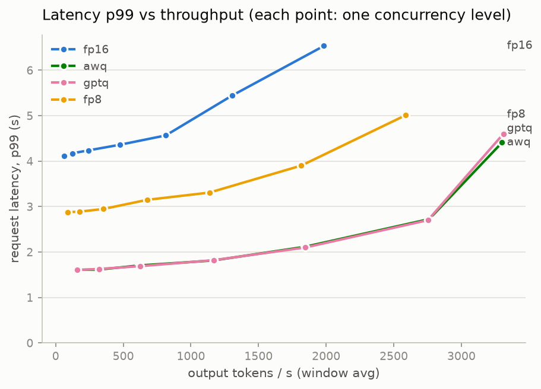
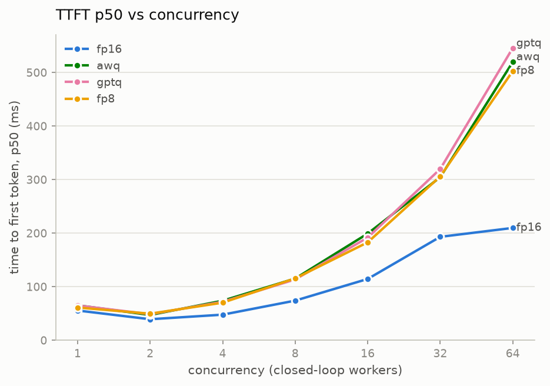

# Experiment: Quantization — AWQ / GPTQ / FP8 vs FP16 (M5)

> The flagship A/B: what does each quantization scheme buy in speed and cost, and what does
> it charge in quality? Control: the [FP16 baseline](baseline_results.md). Raw data:
> [`experiments/quant-awq/`](../experiments/quant-awq/),
> [`…/quant-gptq/`](../experiments/quant-gptq/),
> [`…/quant-fp8/`](../experiments/quant-fp8/); overlay plots in
> [`…/quant-overlay/`](../experiments/quant-overlay/).

## Setup

Same pod class and software stack as M4 — the A/B is clean by construction:

| | |
|---|---|
| GPU / stack | RTX 4090 24 GB (RunPod secure, $0.69/hr), driver 570.195.03, vLLM 0.25.1+cu129, torch 2.11.0+cu129 |
| Serve command | `vllm serve <checkpoint>` — all defaults, exactly like the baseline |
| AWQ 4-bit | `Qwen/Qwen2.5-7B-Instruct-AWQ` (official) → **Marlin kernel** (`AutoAWQMarlinLinearMethod`), fp16 activations |
| GPTQ 4-bit | `Qwen/Qwen2.5-7B-Instruct-GPTQ-Int4` (official) → **Marlin kernel** (`AutoGPTQLinearMethod`), fp16 activations |
| FP8 | `RedHatAI/Qwen2.5-7B-Instruct-FP8-dynamic` → **`CutlassFP8ScaledMMLinearKernel` for `CompressedTensorsW8A8Fp8`** — true W8A8 FP8 compute on Ada (SM 8.9), *not* a weight-only fallback (the open question from the M4 plan, settled at serve time; evidence in each run's `serve_log_extract.txt`) |

Protocol (verified, not assumed):

- **Workload**: byte-identical copy of `experiments/baseline-fp16/workload.json` (512 in /
  256 out `ignore_eos`, 200-token shared prefix, 128 seeded prompts), same c=1…64 sweep,
  128 measured + 8 warmup per level — `cmp` confirms all three specs identical to M4's.
- **Eval**: same seeded 300-question GSM8K subset (content hash `561bfdbefb4fee69` in all
  four runs), 5-shot, temperature 0.
- **Prefix caching** (ON by default) is exactly symmetric: every variant recorded
  689,187 cache queries / 619,696 hits (**89.9%**) — identical counters across variants,
  matching the baseline's 90%. TTFT rows at c≥2 measure cached prefills, on both sides.
- **0 errors** in all 2,856 sweep requests and 900 eval questions; `vllm:num_preemptions_total = 0`
  on every variant.
- One dtype nuance: the 4-bit checkpoints declare `torch_dtype=float16` so activations run
  fp16, while baseline and FP8 run bf16. Same numeric family and precision class; noted for
  completeness, not corrected for.

## Results

Window-average throughput per level (tok/s), with steady-state estimate¹ at c=64:

| c | FP16 | AWQ | GPTQ | FP8 |
|---|---|---|---|---|
| 1 | 62.2 | 158.4 (**2.55×**) | 159.3 (**2.56×**) | 88.8 (1.43×) |
| 4 | 243.1 | 614.5 | 623.5 | 352.5 |
| 8 | 475.3 | 1,163.8 | 1,167.9 | 676.8 |
| 16 | 814.1 | 1,840.3 | 1,844.1 | 1,137.5 |
| 32 | 1,303.3 | 2,761.6 | 2,753.0 | 1,816.7 |
| 64 | 1,982.9 | 3,300.7 | 3,310.5 | 2,585.9 |
| 64, steady-state¹ | 2,795 | 4,111 (**1.47×**) | 4,234 (**1.51×**) | 3,459 (1.24×) |

¹ `c × 256 / median latency` — the honest high-concurrency number under this closed-loop
protocol (the 128-requests-per-level window has a drain artifact, symmetric across variants;
see the baseline writeup).

*(The plotted throughput curves are the window-average rows of the table above — at
c=64 they sit ~30% below the steady-state row because of the drain artifact¹, which is
symmetric across variants; shapes and ratios are unaffected.)*

## The trade-off table

| | FP16 (control) | AWQ 4-bit | GPTQ 4-bit | FP8 W8A8 |
|---|---|---|---|---|
| Decode speed c=1 (1/TPOT) | 63.0 tok/s | 165.6 (**2.63×**) | 166.4 (**2.64×**) | 90.7 (1.44×) |
| Steady-state c=64 | 2,795 tok/s | 4,111 (1.47×) | 4,234 (1.51×) | 3,459 (1.24×) |
| Request latency p50, c=1 | 4.10 s | 1.61 s | 1.60 s | 2.87 s |
| TTFT p50 / p99, c=4 | 48 / 71 ms | 74 / 120 ms | 72 / 113 ms | 70 / 124 ms |
| TTFT p50 / p99, c=64 | 210 / 854 ms | 520 / 980 ms | 546 / 948 ms | 503 / 879 ms |
| Latency p99, c=64 | 6.54 s | 4.41 s | 4.60 s | 5.01 s |
| GSM8K (300q) | **92.7%** | 90.0% (−2.7) | 90.3% (−2.3) | 90.3% (−2.3) |
| GSM8K churn (flips) | — | 20 (14↓ / 6↑) | 15 (11↓ / 4↑) | **11** (9↓ / 2↑) |
| KV-cache pool | 116,400 tok (6.2 GiB) | 284,864 (15.21 GiB, **2.45×**) | 285,280 (15.24 GiB, **2.45×**) | 226,320 (12.09 GiB, 1.94×) |
| Max concurrency @32k ctx (vLLM) | 3.55× | 8.69× | 8.71× | 6.91× |
| $/1M output tok, c=64 steady¹ | $0.069 | $0.047 | **$0.045** | $0.055 |
| $/1M output tok, c=64 window | $0.097 | $0.058 | $0.058 | $0.074 |

## What happened, in the ledger's terms

1. **P10 confirmed — 4-bit batch-1 decode ≈ 2.6× (predicted 2.5–3×).** Decode is a
   weights-streaming problem: 4-bit shrinks the bytes read per token from ~14.1 GB to ~4.5 GB
   (quantized blocks + fp16 lm_head), and TPOT drops 15.87 → 6.0 ms. Both Marlin-served
   checkpoints land within 0.5% of each other — at batch 1 they are the same kernel reading
   the same number of bytes.
2. **P11 confirmed — peak-throughput gain (1.47–1.51×) is much less than the batch-1 gain
   (2.6×).** Batching amortizes weight reads, which is exactly the resource quantization
   saves; as concurrency grows the shared-weight read matters less and the compute wall
   (dequant + GEMM) moves left. The 4-bit TPOT curve is flat until c≈16 then bends upward
   (+105% from c=1 to c=64, vs +34% for FP16) — the compute wall arriving on schedule.
3. **Quantization does NOT buy TTFT — under load it costs TTFT.** Prefill is compute-bound,
   so 4-bit weights don't accelerate it (Marlin dequant adds work; TTFT at c=1 is 56 ms FP16
   vs 61–65 ms quantized). At c=64 the closed loop turns requests over ~2× faster on the
   quantized servers → ~2× the prefill arrivals per second → TTFT p50 210 → 520–546 ms.
   Faster decode shifts the bottleneck toward prefill; a TTFT-sensitive service does not get
   its TTFT back from quantization.
4. **The KV-headroom story is real and measured: 2.45× for 4-bit** (pool 6.2 → 15.2 GiB),
   1.94× for FP8 — against the ledger's ~2.8× naive prediction (the gap: vLLM's activation /
   CUDA-graph overhead doesn't shrink with weights). This is the durable product of
   quantization at scale: room for 2.4× the concurrent requests before the KV wall, on the
   same card. The 512/256 sweep never approaches that wall (0 preemptions), so it shows up
   here as headroom, not throughput.
5. **FP8 is the gentle middle.** True W8A8 on Ada (verified kernel), 1.43× batch-1, 1.24×
   steady-state, smallest quality churn (11 flips vs AWQ's 20). Its bytes/token (~7.6 GB)
   predicts ~1.8×; measured 1.44× — per-token dynamic activation quantization and a less
   mature kernel path on SM 8.9 eat the difference.

### Quality: what actually breaks (flip-list analysis)

Score deltas are small (−2.3 to −2.7 pts) and similar, but **churn tracks quantization
aggressiveness: FP8 11 < GPTQ 15 < AWQ 20 flipped questions**, and flips run in both
directions (every variant also *fixed* 2–6 questions the baseline missed — quantization
perturbs the decision boundary rather than uniformly degrading it).

Reading the flipped transcripts (`python -m inference_lab.evals compare …`), the arithmetic
inside the chains is almost always still correct — what changes is **problem interpretation
at ambiguous or trap-laden steps**:

- `gsm8k-test-0406` (flipped by **all three** variants): "40 fewer corns than the number of
  cannolis" — FP16 reads "than the 60 he just bought" (matching the gold), every quantized
  variant reads "than his new total of 100"; both then compute their reading flawlessly.
- `gsm8k-test-0004` (AWQ): misreads "3 cups per chicken per day, split over 3 meals" as
  "3 cups per meal" and correctly computes the wrong plan.
- `gsm8k-test-0143` (FP8): classifies light bulbs as food before applying the non-food tax —
  a semantic slip, then perfect tax arithmetic.

So on GSM8K at 7B, ~1 bit of weight noise shows up as *judgment* errors on borderline
phrasing, not as broken arithmetic. Products whose inputs are unambiguous lose less than the
headline delta suggests; products full of subtle constraints should weight the churn number,
not the score.

## Which workload should pick which variant

- **Throughput / cost-driven batch pipelines: GPTQ-Int4** (or AWQ — statistically the same
  performance). $0.045 vs $0.069 per 1M output tokens steady-state — **35% cheaper**, and
  the gap widens past c=64 because of the 2.45× KV headroom. GPTQ edges AWQ here on quality
  (−2.3 vs −2.7, churn 15 vs 20) at identical speed.
- **Interactive chat (c ≲ 16, decode-dominated): 4-bit.** Per-user streaming is 2.6× faster
  (6 ms/token ≈ 165 tok/s — far past reading speed) and full-response latency drops 4.1 → 1.6 s.
- **Quality-sensitive (math/code/agents) that still wants a discount: FP8.** Same score
  delta as GPTQ but half the churn of AWQ and the gentlest failure mode; 20% cheaper than
  FP16. For strict quality bars, stay FP16 — or better, re-run this eval on your own task
  before deciding; a 300-question GSM8K subset is a detector, not a guarantee.
- **TTFT-bound services (prefix-heavy, high fan-in): quantization is not your lever.** It
  makes TTFT *worse* under load (finding 3). Prefix caching / prefill scheduling (M6) is the
  right aisle.
- **Rejected: nothing outright.** All three are usable; AWQ is dominated here (same speed as
  GPTQ, slightly worse quality), so within this model family there's no reason to prefer it.

## Cost note

Session: ~1.25 GPU-hours ≈ **$0.86** (setup + all three variants; measurement block itself
was 38 minutes — the resumable-script discipline from M4 paid off). Project GPU spend to
date: ~$3.62.
