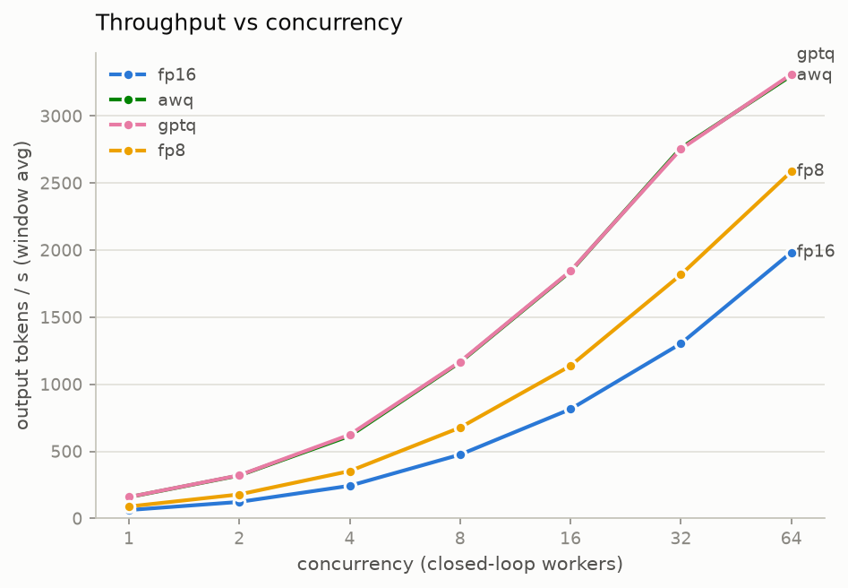
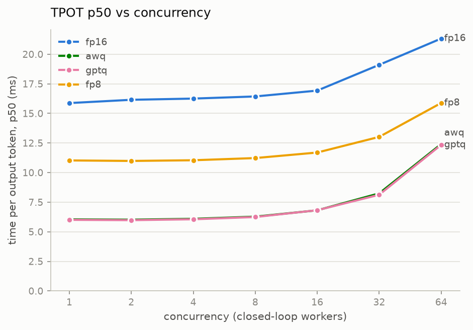
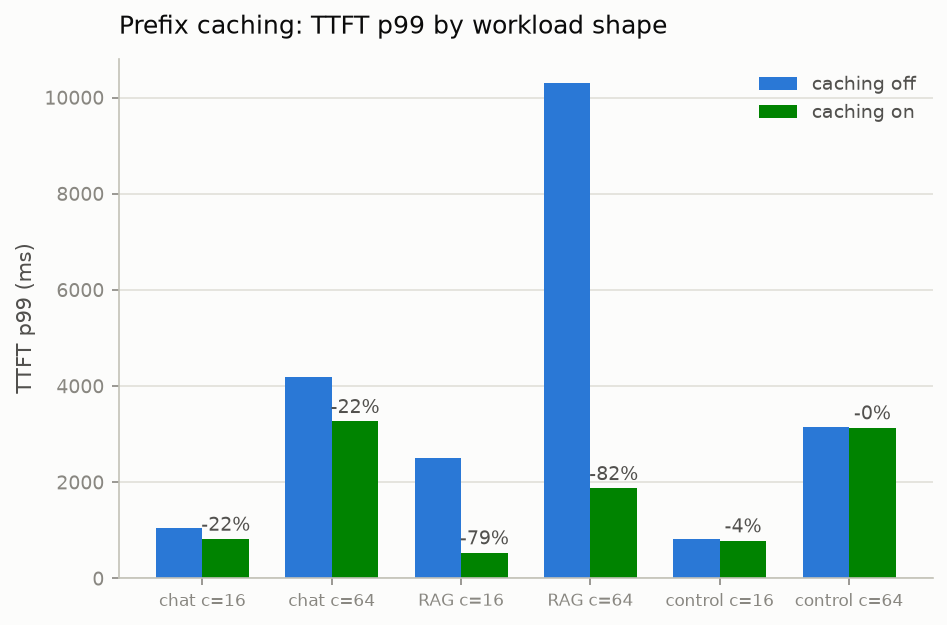
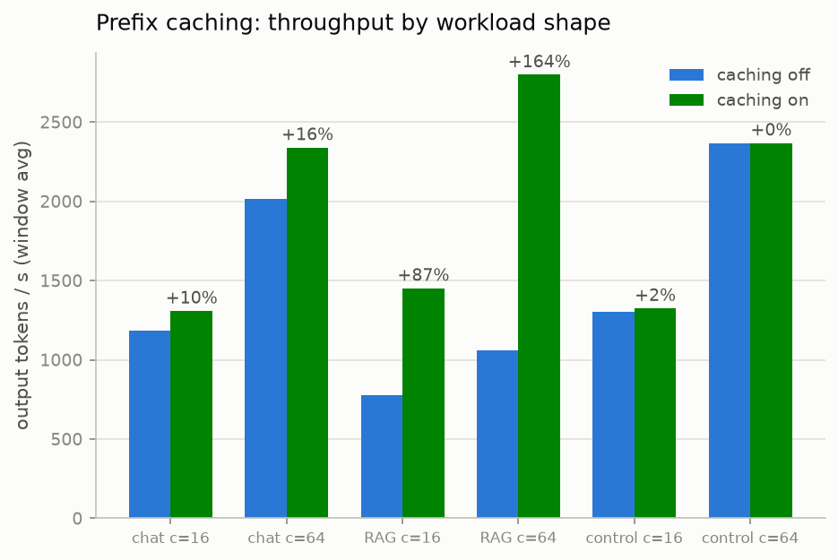
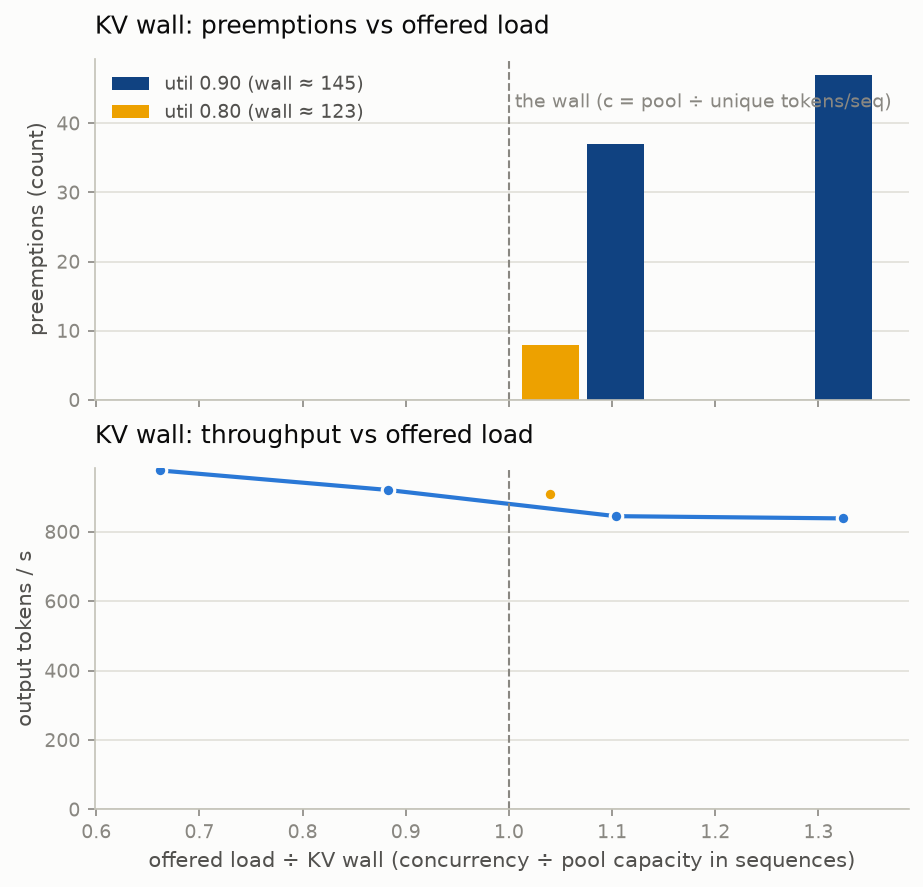
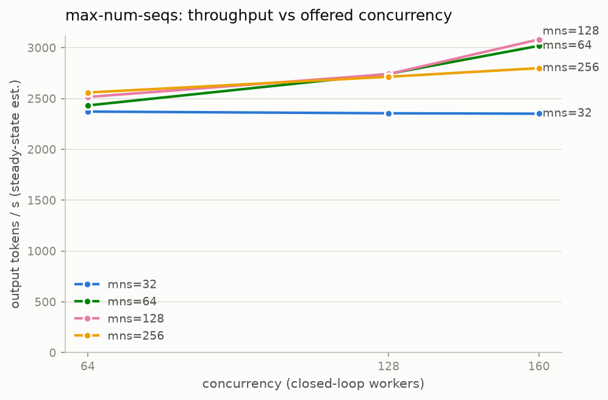
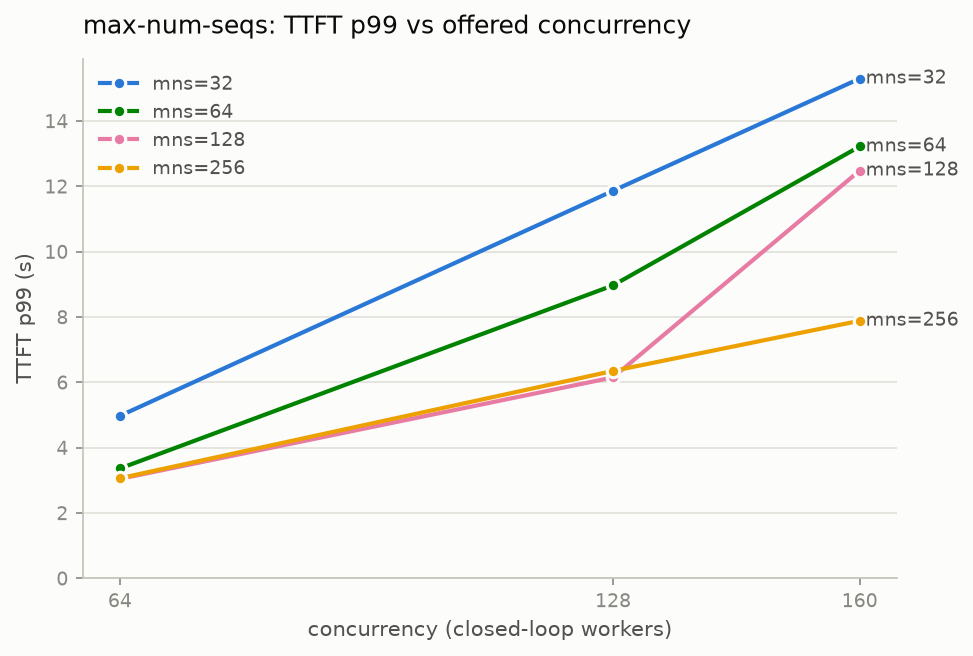
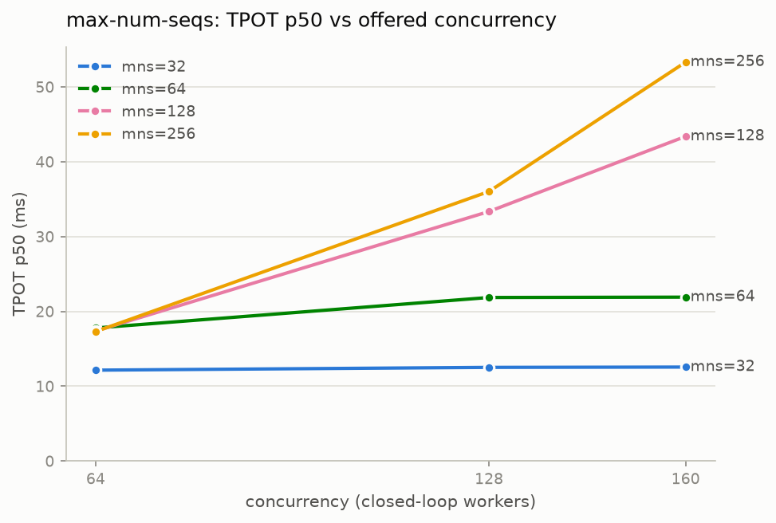
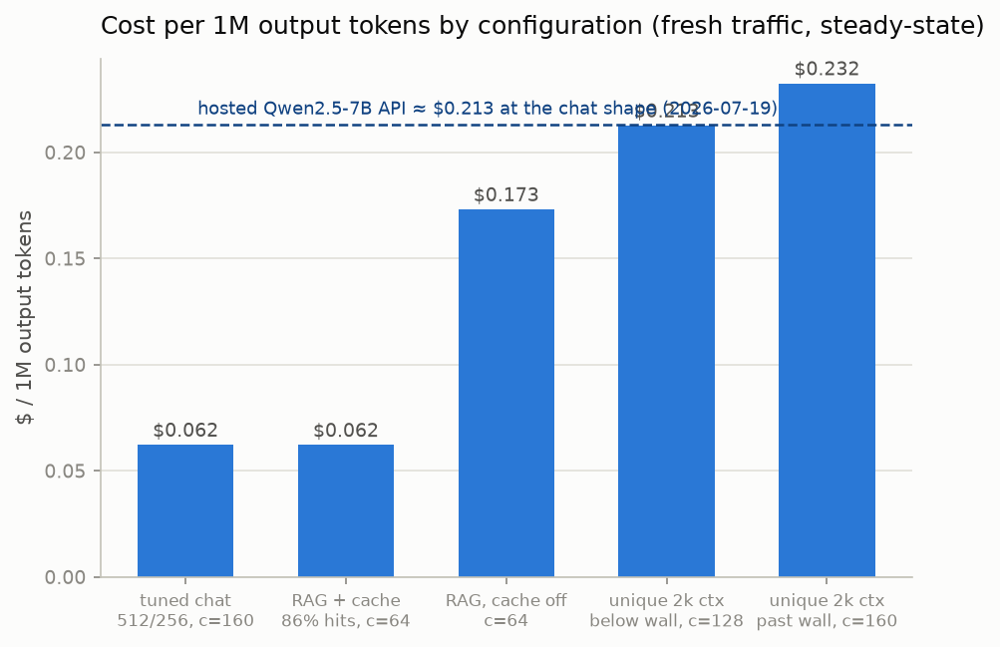

# Serving Qwen2.5-7B on a Single RTX 4090: An Optimization Report

> **What this is.** A measured, reproducible account of what each major vLLM serving
> optimization — quantization (AWQ/GPTQ/FP8), automatic prefix caching, and the
> batching/KV-cache knobs — actually buys in speed, dollars, and answer quality on one
> well-characterized deployment, and a decision map for choosing a configuration by
> workload. Every number traces to a raw-data directory under
> [`experiments/`](../experiments/); every figure regenerates from committed data via
> [`scripts/make_report_plots.py`](../scripts/make_report_plots.py).

---

## 1. Executive summary

1. **4-bit quantization (GPTQ/AWQ) makes each decoded token 2.6× faster and each million
   tokens 35% cheaper** (TPOT 15.9 → 6.0 ms; $0.069 → $0.045 per 1M output tokens at
   c=64 steady-state) — but the peak-throughput gain is only 1.5×, because batching
   amortizes exactly the weight-read cost quantization shrinks.
2. **Quantization never buys time-to-first-token — under closed-loop load it costs TTFT**
   (p50 210 → 520–546 ms at c=64): prefill is compute-bound and dequantization adds work.
   The TTFT lever is prefix caching, which cut TTFT p99 by exactly the prefix's share of
   prefill — −82% on a RAG shape with an 86% cache-hit rate — and lifted its throughput
   2.6× (1,060 → 2,799 tok/s).
3. **The KV-cache preemption wall sits exactly where arithmetic puts it — pool ÷ *unique*
   tokens per sequence:** 0 preemptions at 0.88× the computed wall, 37 at 1.10×, 47 at
   1.32×, and crossing it lowers throughput (920 → 845 tok/s) while p99 latency climbs
   57 → 92 s. With a shared prefix, caching multiplies effective KV capacity ~3.9×: the
   same offered load ran at 3,195 tok/s with zero preemptions.
4. **Quality loss from quantization is a judgment shift, not broken math:** GSM8K drops
   only −2.3 to −2.7 points (from 92.7%), but the churn ordering FP8 11 < GPTQ 15 < AWQ 20
   flipped questions tracks quantization aggressiveness, and every inspected flip was a
   misreading of ambiguous phrasing followed by flawless arithmetic.
5. **Self-hosting this model costs $0.062 per 1M output tokens at full utilization
   ($0.69/hr pod, tuned config) — ~3.4× cheaper than renting the same model behind a
   hosted API ($0.213 at the same traffic shape) — but the API wins below ~29% sustained
   utilization**, because the pod bills wall-clock hours whether or not tokens flow.

---

## 2. Methodology

### 2.1 Hardware, software, model

| | |
|---|---|
| GPU | NVIDIA GeForce RTX 4090, 24 GB GDDR6X (RunPod secure cloud, $0.69/hr) — same GPU class for every run |
| Driver / CUDA | 570.172.08–570.195.03 / 12.9 (cu129 wheels; per-run versions in each `meta.json`) |
| Serving stack | vLLM 0.25.1+cu129, torch 2.11.0+cu129, Python 3.12 |
| Model | Qwen2.5-7B-Instruct (bf16 baseline) and its official AWQ, GPTQ-Int4, and FP8-dynamic checkpoints |
| Server flags | Baseline and M5: `vllm serve <model>` all-defaults. M6: only the flag under test varies; serve-log extracts committed per run |

Relevant vLLM defaults, because they shape everything below: **automatic prefix caching
ON**, chunked prefill ON, `gpu-memory-utilization 0.90`, `max-num-seqs 256`.

### 2.2 Load-testing harness

All performance numbers come from a self-built async closed-loop harness
([`inference_lab/loadtest/`](../inference_lab/loadtest/)): N workers each keep one
streaming request in flight against the OpenAI-compatible endpoint, measuring per request
TTFT, TPOT, total latency, and token counts (from the server's `usage` block, not chunk
counts). Workloads are seeded synthetic prompts with controlled token shapes (tokenizer-
exact input/output budgets, configurable shared system prefix, per-request unique markers
so nothing shares KV beyond the intended prefix), plus one ShareGPT run as a realism
check. Every run directory contains the workload spec, environment metadata, raw
per-request JSONL (every aggregate is recomputable), and per-level summaries.

**Cross-validation (the credibility anchor).** Under a matched condition (512 in / 256
out, c=16, 128 requests, 4 + 3 alternating repetitions, every number stable to ±2%), the
harness was run head-to-head against vLLM's own `vllm bench serve`
([`experiments/baseline-fp16-validation/`](../experiments/baseline-fp16-validation/)):

| Metric | harness | `vllm bench` | Δ |
|---|---|---|---|
| TPOT p50 | 17.7–18.0 ms | 18.0 ms | ≤2% ✅ |
| TTFT p99 | 718–764 ms | 732–733 ms | ≤4% ✅ |
| TTFT p50 | 460–509 ms | 410–412 ms | +12–23% — definitional (see below) |
| Output throughput | 722–727 tok/s | 818–819 tok/s | −12% — accounting (decomposed) |

Both residual gaps are understood mechanically, not hand-waved. **TTFT**: vLLM's bench
stamps TTFT on the first SSE chunk with a `choices` entry — including the role-only,
empty-content chunk vLLM opens every stream with; this harness waits for the first
non-empty content token, the stricter user-visible definition. **Throughput**: the gap
decomposes into warmup requests consuming server capacity inside our measurement window
while excluded from the numerator (~6%, a deliberate conservative convention), the TTFT
definition (~2.5%), measured closed-loop worker turnaround (9 ms median, ~2.5%), and TPOT
(~1%). Every difference is a documented convention that cancels in A/B comparisons,
since both sides of every experiment use the same harness.

### 2.3 Quality eval

Seeded, fixed 300-question GSM8K subset (content hash `561bfdbefb4fee69` identical in
all runs), 5-shot, temperature 0, exact-match on the parsed final number; failed requests
score as wrong so denominators stay comparable. A comparison utility reports the score
delta **and the list of flipped questions** — the churn metric that turned out to carry
the real signal (§4.3). Raw per-question records: `experiments/*/eval/`.

### 2.4 Measurement conventions (read before quoting any number)

Four conventions, all established empirically during the project, qualify every number
in this report:

1. **Window average vs steady-state.** Closed-loop throughput averaged over the full
   window is dragged down at high concurrency by a drain artifact (the level ends with a
   long partial-concurrency tail; at c=64 with 128 requests that's only ~2 "waves" —
   measured 1,983 vs ~2,795 tok/s). Steady-state is estimated as
   `c × output-tokens-per-request / median latency`. **Peak-throughput and $/1M claims
   in this report use steady-state and say so; tables never mix the two.** (M6 runs use
   `num_requests ≥ 4 × concurrency`, which shrinks but does not eliminate the artifact.)
2. **TTFT = first non-empty content token** — stricter than `vllm bench` (§2.2).
3. **Warm vs fresh traffic regime.** The M4/M5 sweeps replayed the same 128 seeded
   prompts across concurrency levels against a server with prefix caching on → ~90%
   full-prompt cache hits → *warm-traffic* numbers (TTFT rows at c≥2 are cached
   prefills). M6 cells use a fresh seed per cell → *cold* numbers. The same server
   config measured **2,559 tok/s fresh vs 4,234 warm (1.65×)** at c=64. All intra-
   experiment A/B *ratios* hold (both sides always share a protocol), but every absolute
   throughput or $/1M number below is labeled with its regime, and cold numbers are
   preferred for absolutes.
4. **Theory bands are per-kernel-scheme.** Measured kernel efficiency against the
   bytes-per-step ceiling: fp16 ~88%, 4-bit Marlin ~74%, Ada W8A8 FP8 ~68%. Predictions
   for a quantized config must use its own band, never fp16's.

### 2.5 Reproducing

`scripts/setup_pod.sh` (pinned versions), `scripts/run_baseline_m4.sh`,
`scripts/run_quant_m5.sh`, `scripts/run_m6.sh` re-run the measurement sessions;
`python scripts/make_report_plots.py` rebuilds every figure in this report from the
committed `experiments/` data. Total GPU spend for all data in this report: **~$4.72**
(~6.9 GPU-hours across three sessions, tracked per run).

---

## 3. Theory vs measurement

Before renting a GPU, the project wrote a
[performance ledger](../docs/performance_ledger.md) predicting every headline number
from first principles (roofline model: prefill is compute-bound, decode is
memory-bandwidth-bound; KV arithmetic from the model config). The measurements then
confronted it. Predictions P1/P3/P5 (A10 rows) remain open — only one GPU class was
rented.

| # | Prediction (4090, 512 in / 256 out) | Predicted | Measured | Verdict |
|---|---|---|---|---|
| P2 | Batch-1 decode | 46–56 tok/s | **63.0 tok/s** — 88% of the 71.5 tok/s bytes ceiling | ✅ above band — assumption updated |
| P4′ | TTFT at c=1 | 49–98 ms (cache-adjusted) | **56 ms** (~53% MFU) | ✅ |
| P6′ | Throughput at c=64 | 2,520–3,190 tok/s | **2,795 steady-state** | ✅ |
| P7 | Scaling 1→8 | ≥6× | **7.64×** | ✅ |
| P8 | No KV wall ≤ c=64 | 0 preemptions | **0 preemptions**, 0 errors / 952 req | ✅ |
| P9 | TPOT degradation 1→64 | +10–20% | **+34%** | ❌ — root-caused |
| P10 | 4-bit batch-1 speedup | 2.5–3× | **2.63×** | ✅ |
| P11 | 4-bit peak-throughput speedup | well under batch-1 gain | **1.47–1.51×** | ✅ |
| P12 | Long-context preemption at computed wall | wall ≈ pool ÷ tokens/seq | **on the nose** (§6) | ✅ |

Three lessons the misses taught:

- **P9 (+34% vs +10–20%):** the pure KV-read-growth model omits per-step
  scheduler/sampler overhead that grows with batch size, and chunked prefill
  interleaving fresh prefills into decode steps. The ledger now carries a ~0.85 batch
  efficiency factor. The *shape* prediction (gradual, no cliff) held.
- **P2 (above the band):** the assumed 70–85% bandwidth efficiency was stale folklore;
  GDDR6X + current vLLM kernels achieve 85–95%. Overshooting a prediction is still an
  epistemic miss — the assumption, not the win, gets recorded.
- **Prefix caching qualifier:** vLLM's default-on caching means TTFT predictions must
  scale by the *fresh* fraction of the prompt — measured 56 ms at ~332 fresh of 540
  total tokens, exactly the scaled band.

The durable payoff of the ledger: measurements can be graded ("88% of ceiling — healthy;
74% — that's what a 4-bit Marlin kernel costs") instead of merely reported.

---

## 4. Experiment: quantization (AWQ 4-bit, GPTQ-Int4, FP8 W8A8)

**Setup.** Official quantized checkpoints served with otherwise-identical default flags;
byte-identical workload spec and seeds as the FP16 baseline (`cmp`-verified); identical
seeded GSM8K subset. Prefix-cache counters identical across all four variants (89.9%
hits — warm regime, symmetric on both sides). Raw data:
[`experiments/quant-{awq,gptq,fp8}/`](../experiments/), baseline in
[`experiments/baseline-fp16/`](../experiments/baseline-fp16/). FP8 runs true W8A8
compute on Ada (Cutlass kernel, verified in the serve log), not a weight-only fallback.

| | FP16 (control) | AWQ 4-bit | GPTQ-Int4 | FP8 W8A8 |
|---|---|---|---|---|
| Decode speed c=1 (1/TPOT) | 63.0 tok/s | 165.6 (**2.63×**) | 166.4 (**2.64×**) | 90.7 (1.44×) |
| Steady-state throughput c=64¹ | 2,795 tok/s | 4,111 (1.47×) | 4,234 (**1.51×**) | 3,459 (1.24×) |
| Request latency p50, c=1 | 4.10 s | 1.61 s | 1.60 s | 2.87 s |
| TTFT p50, c=64¹ | **210 ms** | 520 ms | 546 ms | 503 ms |
| GSM8K (300q) | **92.7%** | 90.0% (−2.7) | 90.3% (−2.3) | 90.3% (−2.3) |
| GSM8K churn (flips) | — | 20 | 15 | **11** |
| KV-cache pool | 6.2 GiB | 15.2 GiB (**2.45×**) | 15.2 GiB (**2.45×**) | 12.1 GiB (1.94×) |
| $/1M output tokens, c=64 steady¹ | $0.069 | $0.047 | **$0.045** | $0.055 |

¹ Warm-repeated traffic regime (§2.4); ratios transfer, absolutes are upper bounds.

### 4.1 Why the numbers look like this

- **Batch-1 decode is a bytes-streaming problem.** 4-bit shrinks bytes read per token
  from ~14.1 GB to ~4.5 GB (quantized blocks + fp16 lm_head) → TPOT 15.9 → 6.0 ms.
  AWQ and GPTQ land within 0.5% of each other *everywhere* because vLLM lowers both to
  the same Marlin kernel — they are **one 4-bit performance story with two calibration
  recipes**, not two independent datapoints. The only daylight between them is quality.
- **The peak-throughput gain (1.5×) is a third of the batch-1 gain (2.6×).** Batching
  amortizes weight reads across the batch — exactly the resource quantization saves —
  so the two levers overlap rather than stack. The 4-bit TPOT curve bends up past c≈16
  (+105% from c=1→64 vs FP16's +34%): the compute wall arriving early, as the ledger's
  N*≈48 predicted.
- **Quantization does not buy TTFT — under load it costs TTFT.** Prefill is
  compute-bound and Marlin dequant adds work (c=1 TTFT: 56 ms FP16 vs 61–65 ms
  quantized). At c=64 under closed loop, 2× faster decode turns requests over 2× faster
  → 2× the prefill arrivals per second → TTFT p50 210 → 520–546 ms. *Closed-loop
  qualifier:* at a fixed open-loop arrival rate this penalty statement does not transfer
  as-is — there, faster decode drains queues instead of refilling them.
- **The durable product at scale is KV headroom.** 4-bit frees ~9 GB of weights that
  becomes 2.45× the KV pool → 2.45× the concurrent sequences before the preemption wall
  (§6 confirms the wall arithmetic). The predicted ~2.8× was not reached because
  activation/CUDA-graph overhead doesn't shrink with weights.
- **FP8 is the gentle middle:** 1.44× batch-1, 1.24× steady-state (its ~68% kernel
  efficiency on SM 8.9 eats the predicted ~1.8×), smallest quality churn.

### 4.2 Quality: what actually breaks

Score deltas are statistically indistinguishable (−2.3 to −2.7 on 300 questions), but
**churn separates the schemes cleanly: FP8 11 < GPTQ 15 < AWQ 20 flipped questions**,
ordered by quantization aggressiveness — and flips run in both directions (each variant
also *fixes* 2–6 baseline misses; quantization perturbs the decision boundary rather
than uniformly degrading it).

Reading the flipped transcripts
([`docs/experiment_quantization.md`](../docs/experiment_quantization.md) has the full
examples): the arithmetic inside every inspected chain is still correct — what changes
is **interpretation at ambiguous steps**. `gsm8k-test-0406` flipped identically on all
three variants: "40 fewer corns than the number of cannolis" — FP16 reads the referent
matching the gold answer, every quantized variant picks the other reading, then computes
its reading flawlessly. Practical consequence: products with unambiguous inputs lose
less than the headline delta suggests; products full of subtle constraints should weight
the churn number, not the score — and re-run the eval on their own task.

---

## 5. Experiment: automatic prefix caching (APC)

**Setup.** GPTQ-Int4 base (M5's winner), caching ON vs OFF (flag verified in serve
logs), three workload shapes at c=16 and c=64, **fresh seed per cell** (cold regime —
the on/off pair within each cell shares a seed, so the A/B is byte-exact). Raw data:
[`experiments/prefix-cache-*/`](../experiments/).

| shape | shared prefix | unique tokens | prefix share of prefill | measured hit rate |
|---|---|---|---|---|
| chat | 200 | 512 | ~28% | 28.3–28.6% |
| RAG/agent | 1,500 | 240 | ~86% | 84.7–85.5% |
| control | none | 512 | 0% | 2.9–3.8% (block collisions) |

**The cache hit rate equals the prefix's share of prefill — almost exactly** — and the
wins follow it:

| shape, c | TTFT p99 off→on | throughput off→on |
|---|---|---|
| chat, c=64 | 4,186 → 3,266 ms (−22%) | 2,013 → 2,339 tok/s (+16%) |
| **RAG, c=16** | 2,512 → **535 ms (−79%)** | 777 → 1,452 tok/s (**1.87×**) |
| **RAG, c=64** | 10,294 → **1,872 ms (−82%)** | 1,060 → 2,799 tok/s (**2.64×**) |
| control, c=64 | 3,143 → 3,134 ms (0%) | 2,363 → 2,368 tok/s (0%) |

The control moving 0% is the validity check that makes the other cells trustworthy.

**Why.** Prefill is compute-bound; APC deletes the shared prefix's share of prefill
FLOPs entirely. On the RAG shape that's 86% of a large prefill, so TTFT p99 collapses
*and* — under closed loop — the GPU steps freed from prefill flow straight into decode,
which is why throughput jumps 2.6×. Two corollaries worth a hiring manager's attention:

1. **With caching on, long-shared-prefix traffic becomes the *cheapest* shape to serve,
   not the most expensive**: RAG-on at c=64 (2,799 tok/s) out-throughputs even the
   no-prefix control (2,368) because its per-request *unique* work (240 tokens) is
   smallest. Caching off, the same traffic is the most expensive shape (1,060 tok/s).
   One default flag: 2.6× throughput, $0.173 → $0.062 per 1M tokens.
2. **This is the TTFT lever quantization isn't.** M5 showed 4-bit *worsens* loaded TTFT;
   APC attacks exactly the phase quantization left as the bottleneck. The two compose
   cleanly: GPTQ takes decode bytes, APC takes prefill FLOPs.

---

## 6. Experiment: batching and KV-cache pressure

Two sub-experiments on the GPTQ base, fresh seed per cell, `/metrics` snapshots before
and after every cell. Raw data:
[`experiments/batching-grid/`](../experiments/batching-grid/),
[`experiments/kv-pressure/`](../experiments/kv-pressure/).

### 6.1 The KV wall lands exactly where arithmetic puts it

The probe uses **unique ~2,008-token sequences** (1,740 unique input + 256 output) so
each sequence carries its full KV cost — a deliberate design correction: with APC on,
shared-prefix sequences share KV blocks, and the originally planned shared-prefix probe
could never have preempted (its wall sits at ~560 concurrent, unreachable). The wall is
`KV pool ÷ unique tokens/seq`: 291,168 ÷ 2,008 ≈ **145** at util 0.90; 247,120 ÷ 2,008 ≈
**123** at util 0.80.

| cell | c ÷ wall | preemptions | latency p99 | tok/s |
|---|---|---|---|---|
| unique, c=96 | 0.66 | 0 | 39.6 s | 976 |
| unique, c=128 | 0.88 | **0** | 57.2 s | 920 |
| unique, c=160 | **1.10** | **37** | 81.5 s | 845 |
| unique, c=192 | **1.32** | **47** | 91.7 s | 838 |
| unique, c=128 @ util 0.80 | **1.04** | **8** | 57.8 s | 908 |
| shared-prefix, c=160 | 0.29 (effective) | 0 | 15.4 s | **3,195** |

- **Zero preemptions below the wall, dozens above it**, with the predicted thrash
  signature: throughput *falls* past the wall because preempted sequences re-prefill
  their entire ~1,750-token context — pure wasted compute.
- **`gpu-memory-utilization` moves the wall linearly and matters only near it**: at
  c=128, shrinking the pool (0.90 → 0.80) flips the cell from 0 to 8 preemptions; far
  from the wall the same knob changes throughput by 0.5%. The pool is **capacity, not
  speed** — and **util 0.95 refuses to start on this 24 GB card** (CUDA-graph capture
  OOM; evidence kept in
  [`experiments/batching-grid/mns256-util0.95-FAILED/`](../experiments/batching-grid/mns256-util0.95-FAILED/)).
  0.90 is the practical ceiling with this stack.
- **APC is a KV-*capacity* multiplier, not just a TTFT lever**: at the same offered load
  (c=160, same token counts), the shared-prefix cell runs clean at 3,195 tok/s vs the
  unique cells' 845 with 37 preemptions — effective wall deferred ~3.9×.
- **Long-context decode is KV-bandwidth-bound even below the wall**: throughput falls
  976 → 920 tok/s from c=96 → 128 because every decode step reads every live sequence's
  ~2k-token KV; once `c × context × 57 KB` rivals the ~4.5 GB weight read (c ≈ 40 at 2k
  tokens on the 4-bit base), batching buys nothing more.

### 6.2 `max-num-seqs` is an admission valve, not a speed knob

512/256 chat shape (wall ≈ 358, unreachable — no preemption confounds), util 0.90,
grid over `max-num-seqs` ∈ {32, 64, 128, 256} × c ∈ {64, 128, 160}:

| max-num-seqs | tok/s @ c=160 (steady) | TTFT p99 @ c=160 | TPOT p50 @ c=160 | latency p50 |
|---|---|---|---|---|
| 32 | 2,351 | 15.3 s | **12.6 ms** | 17.4 s |
| 64 | 3,019 | 13.2 s | 21.9 ms | 13.6 s |
| **128** | **3,082** | 12.5 s | 43.4 ms | 13.3 s |
| 256 | 2,799 | **7.9 s** | 53.3 ms | 14.6 s |

- **Throughput saturates by mns ≈ 128** (the compute wall N*≈48 on the 4-bit base is
  already passed); 32 caps the batch hard (−17%), 128 and 256 are statistically
  identical.
- **The knob only decides *where* excess load waits.** Small cap: requests queue outside
  the engine — TTFT explodes (15.3 s p99) while the admitted stream fast (TPOT
  12.6 ms). Large cap: everyone is admitted — TTFT halves (7.9 s) but every stream
  slows (53 ms). Median end-to-end latency is nearly invariant (13.3–17.4 s):
  **conservation of waiting**. Pick the knob by which SLO you protect (TTFT vs TPOT),
  not by throughput.
- Sweet spot for this shape: **mns 128–256 at util 0.90** — 128 if you want the
  steady-state edge, 256 if TTFT is the SLO.

Speculative decoding (Experiment C) was **skipped deliberately**; see Limitations (§9).

---

## 7. Cost analysis

All self-hosted costs are `$0.69/hr ÷ measured steady-state output throughput`,
i.e. the cost at full utilization; §7.3 relaxes that assumption. Regimes are never mixed
within a table (§2.4).

### 7.1 Cost per configuration

**Fresh (cold) traffic — the honest absolute numbers (M6 cells):**

| configuration, workload | tok/s (steady) | $/1M output tokens |
|---|---|---|
| GPTQ, tuned mns=128/util 0.90, chat 512/256, c=160 | 3,082 | **$0.062** |
| GPTQ, RAG shape + APC (86% hits), c=64 | 3,086 | **$0.062** |
| GPTQ defaults, chat 512/256, c=64 | 2,559 | $0.075 |
| GPTQ, RAG shape, caching off, c=64 | 1,108 | $0.173 |
| GPTQ, unique 2k contexts below the wall, c=128 | 902 | $0.213 |
| GPTQ, unique 2k contexts past the wall, c=160 | 825 | $0.232 |

**Warm-repeated traffic — quantization comparison (M4/M5 sweeps; ratios transfer,
absolutes are upper bounds):**

| variant, c=64 | tok/s (steady) | $/1M output tokens |
|---|---|---|
| FP16 baseline | 2,795 | $0.069 |
| FP8 W8A8 | 3,459 | $0.055 |
| AWQ 4-bit | 4,111 | $0.047 |
| GPTQ-Int4 | 4,234 | **$0.045** |

The spread across *workload shapes* (3.7× between the tuned config and past-the-wall
long-context traffic) is wider than the spread across *quantization schemes* (1.5×) —
knowing your traffic shape is worth more than any single serving flag.

### 7.2 Commercial API comparison (prices fetched 2026-07-19)

API prices are per-token on input and output separately; self-hosted $/1M above is per
*output* token with input processing included. To compare apples to apples, each API
price below is converted to **$ per 1M output tokens at this report's fresh chat shape**
(~724 prefill / 256 output tokens per request → 2.83 input tokens per output token):
`out_price + 2.83 × in_price`.

| API (small/cheap tier) | list $/1M in | list $/1M out | $/1M output-equivalent @ chat shape |
|---|---|---|---|
| Qwen2.5-7B-Instruct, hosted ([OpenRouter](https://openrouter.ai/qwen/qwen-2.5-7b-instruct), 2026-07-19) | $0.04 | $0.10 | **$0.21** |
| Llama-3.1-8B Turbo ([DeepInfra](https://deepinfra.com/pricing), 2026-07-19)² | $0.02 | $0.03 | $0.09 |
| Gemini 2.5 Flash-Lite ([Google](https://ai.google.dev/gemini-api/docs/pricing), 2026-07-19) | $0.10 | $0.40 | $0.68 |
| GPT-5.4-nano ([OpenAI](https://developers.openai.com/api/docs/pricing), 2026-07-19) | $0.20 | $1.25 | $1.82 |
| Claude Haiku 4.5 (Anthropic, 2026-06) | $1.00 | $5.00 | $7.83 |
| **Self-hosted GPTQ (this report), full utilization** | — | — | **$0.062** |

² Different model (8B Llama vs 7B Qwen, aggressive "Turbo" pricing) — included as the
cheapest open-weights-API datapoint, not as a same-model comparison. Commercial small
models (Flash-Lite, GPT-5.4-nano, Haiku) are generally *stronger* models than a 7B —
this table prices the serving, not the intelligence. Prices change frequently; treat the
date as part of every number. Hosted APIs also discount cached input tokens, which
narrows the gap on prefix-heavy traffic.

### 7.3 Break-even: when does self-hosting win?

The pod bills $0.69/hr whether or not tokens flow; APIs bill per token. Break-even
utilization = (pod $/hr) ÷ (API cost of the pod's full-utilization token volume).
**Assumptions: tuned config capacity 3,082 output tok/s (11.1M output tokens/hr), fresh
chat-shape traffic (2.83 in-tokens per out-token), steady-state accounting, single pod,
zero ops labor and zero redundancy.**

| vs API | API cost of one pod-hour of tokens | self-hosting wins above |
|---|---|---|
| Hosted Qwen2.5-7B (same model) | $2.36/hr | **~29% sustained utilization** (~900 tok/s around the clock) |
| Gemini 2.5 Flash-Lite | $7.58/hr | ~9% |
| GPT-5.4-nano | $20.2/hr | ~3.4% |
| Llama-3.1-8B Turbo (different model) | $0.96/hr | ~71% |

**The honest reading:** below ~29% sustained utilization, renting the same model behind
an API is cheaper — and that threshold understates the API's advantage, because it
prices none of the engineering time this report itself represents, no failover, and no
autoscaling. Self-hosting wins on cost only with steady saturating traffic (batch
pipelines, high-QPS products), and wins on other axes — data control, latency
determinism, custom serving policy (e.g. the prefix-cache economics of §5) — regardless
of volume. Against the cheapest open-weights APIs (the Llama row), a single-GPU
deployment at honest utilization is barely competitive on cost alone; the case rests on
the other axes, on owning the cache behavior, or on larger/cheaper GPUs than this
$0.69/hr 4090.

---

## 8. Decision map

"If your workload looks like X, choose Y, because Z" — the point of the whole exercise.
All configs are Qwen2.5-7B on a 24 GB Ada-class card, vLLM 0.25.

| Workload | Configuration | Why (evidence) |
|---|---|---|
| **Latency-sensitive chatbot** (streaming UX, c ≲ 16) | **4-bit GPTQ**, defaults, moderate `max-num-seqs` | Per-user streaming is what users feel: 2.6× faster decode (6 ms/token ≈ 166 tok/s, far past reading speed), full response 4.1 → 1.6 s (§4). **Split your SLO:** quantization buys TPOT, *never* TTFT — loaded TTFT got worse under closed loop (210 → ~530 ms p50 at c=64). If TTFT is the binding SLO, the levers are a shared system-prefix + APC (§5) and a *higher* admission cap (§6.2), not quantization. (Closed-loop qualifier: at fixed open-loop arrival rates the TTFT penalty statement doesn't transfer as-is.) |
| **Throughput batch pipeline** (overnight jobs, cost per token is everything) | **GPTQ-Int4, `max-num-seqs` 128, util 0.90**, run near saturation | Cheapest measured tokens: $0.045/1M warm, $0.062 cold (§7.1) — 35% below FP16 — and 2.45× KV headroom keeps the knee far right. AWQ is performance-identical (same Marlin kernel) with slightly worse quality; there's no reason to prefer it. mns=32 costs 17% throughput; beyond 128 buys nothing (§6.2). |
| **Quality-critical service** (math/code/agents) | **FP8 W8A8** for a 20% discount at minimal churn; **FP16** for strict bars | Score deltas tie (−2.3), but churn is the real metric: FP8 flips 11 questions vs AWQ's 20, and what flips is interpretation at ambiguous steps, not arithmetic (§4.2). If inputs are ambiguity-laden, stay FP16 — and in all cases re-run the eval on *your* task; 300 GSM8K questions are a detector, not a guarantee. |
| **Prefix-heavy agent workload** (shared system prompt / few-shot / tool spec, ≳1k shared tokens) | **GPTQ + APC ON** (the default — don't turn it off) | The prefix's share of prefill comes back as TTFT and throughput, measurably 1:1 (86% share → −82% TTFT p99, 2.6× throughput, §5). This traffic becomes the *cheapest* to serve ($0.062/1M) and APC multiplies effective KV capacity ~3.9× (§6.1). The one lever that pairs with quantization instead of fighting it. |
| **Unique-long-context service** (RAG with per-request distinct documents) | **GPTQ, util 0.90, capacity-planned in KV-tokens** — admission cap ≤ pool ÷ tokens/seq | The sharpest "know your workload" contrast with the row above — same token counts, opposite economics: no shared blocks means every sequence pays full KV. This regime is KV-bandwidth-bound (throughput *falls* with concurrency even below the wall), costs **3.4×** the tuned config ($0.213 vs $0.062/1M), and crossing the wall makes it strictly worse in both dollars and p99 (§6.1). Plan capacity as `pool ÷ tokens-per-seq` (here: 145 sequences), never in requests/sec — and cap admission below it. |

---

## 9. Limitations & future work

Stated plainly, because the boundaries of the evidence are part of the evidence:

- **One GPU class.** Everything is one RTX 4090 (24 GB, $0.69/hr). The ledger's
  cross-GPU predictions (A10 rows P1/P3/P5 — decode should scale with the 1.68×
  bandwidth ratio, TTFT with the 1.32× compute ratio) remain untested. Datacenter cards
  (L4/A10/L40S) change both the $/hr and the roofline.
- **One model at 7B scale.** The code is model-agnostic; the *numbers* are not.
  Larger models shift every ratio (KV-per-token, quantization sensitivity, walls).
- **Quality evidence is one 300-question GSM8K subset.** Sensitive enough to order the
  schemes by churn; not a claim about any other capability. No MMLU/HumanEval axis.
- **Closed-loop load only.** Arrival rate adapts to server speed, which flatters
  saturated servers (no unbounded queue growth) and shapes the TTFT findings flagged in
  §4.1 and §8. Open-loop (Poisson-arrival) generation is designed but not built.
- **Speculative decoding was skipped, deliberately.** Validating a spec-decode setup
  that vLLM 0.25's v1 engine supports for a GPTQ-quantized Qwen2.5 target (EAGLE-style
  vs ngram vs draft model) is a measurement session of its own with real risk of burning
  budget on an immature path; A+B consumed the session. Worth revisiting only if a
  low-concurrency latency gap matters — the regime where it should help.
- **Single-run cells.** M6 cells are one run each (the M4 validation repetitions showed
  ±2% run-to-run stability under this protocol, so effects of 10%+ are safely outside
  noise, but no per-cell error bars exist).
- **No SGLang / TensorRT-LLM comparison.** vLLM only; the cross-engine question is open.
- **Prices dated 2026-07-19.** The API comparison and break-even shift with every price
  change; recompute before deciding.

Future work, in value order: open-loop arrival generation; an A10/L4 session to close
P1/P3/P5 (the two-ratio diagnostic is the most falsifiable prediction left);
FP8 KV cache (`--kv-cache-dtype fp8`) — an orthogonal halving of KV bytes that should
move both walls; a second eval axis; speculative decoding at c ∈ {1,4}.

---

*All raw data, specs, and environment metadata: [`experiments/`](../experiments/).
Per-experiment writeups with full mechanism discussion:
[`docs/baseline_results.md`](../docs/baseline_results.md),
[`docs/experiment_quantization.md`](../docs/experiment_quantization.md),
[`docs/experiment_caching_batching.md`](../docs/experiment_caching_batching.md).
Theory: [`docs/performance_ledger.md`](../docs/performance_ledger.md).*
